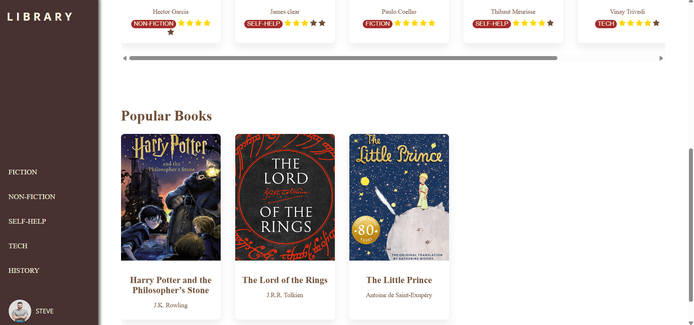

# Online-Library-Shelf
A visually appealing, accessible library-shelf UI built with only HTML &amp; CSS. This repository contains a responsive bookshelf-style interface that showcases book cover cards, a vertical navigation sidebar, a welcoming hero banner showing the current read, and a horizontal recommended-reads row.

FEATURES

* Vertical left navigation pane with category links (Fiction, Non-Fiction, Self-Help, Tech, History).

* Hero banner showing a friendly welcome and the user's current reading (e.g. IKIGAI).

* Books Grid: visually-styled cards for books with cover image, title, author, genre tag, and star rating.

* Horizontal recommended/featured books row with smooth scrolling (CSS overflow-x).

* CSS-only star ratings and hover tooltips/popups for brief reviews or rating details.

* Card shadows and rounded frames to mimic physical book spines and frames.

* Semantic HTML elements (header, nav, main, section, article, footer).

* Mobile-first responsive layout that switches card grid to multi-row and collapses sidebar to top or hamburger (CSS-only solution recommended; small JS optional).

HOW TO RUN

  1.Clone the repository:

    git clone https://github.com/<your-username>/booknest.git
    cd booknest

  2.Open index.html in your browser (no build step required).

SCREEN SHOT 

